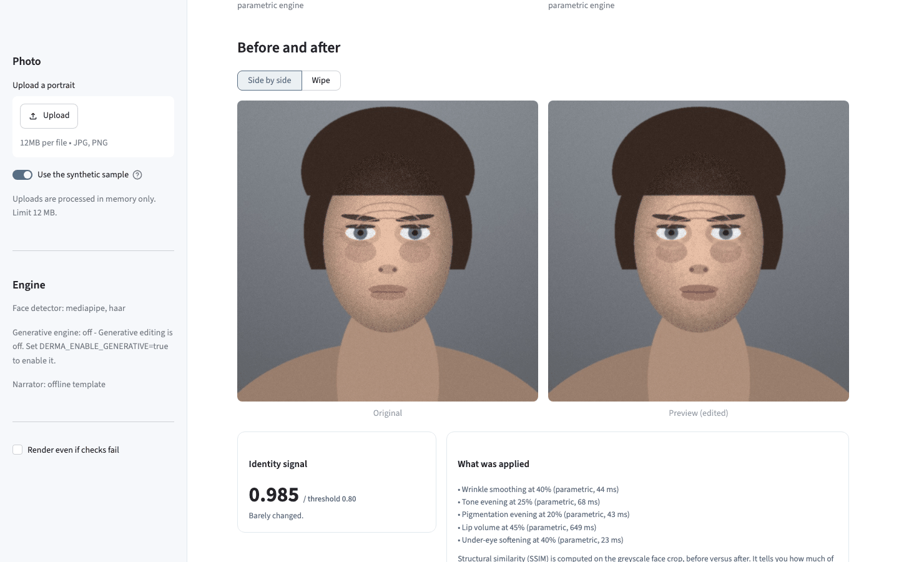
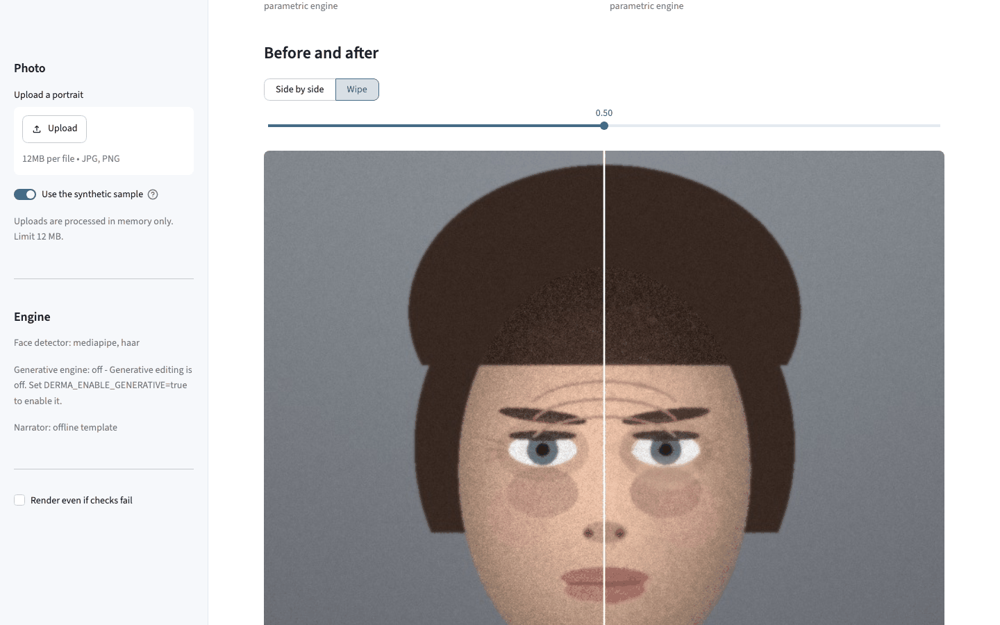
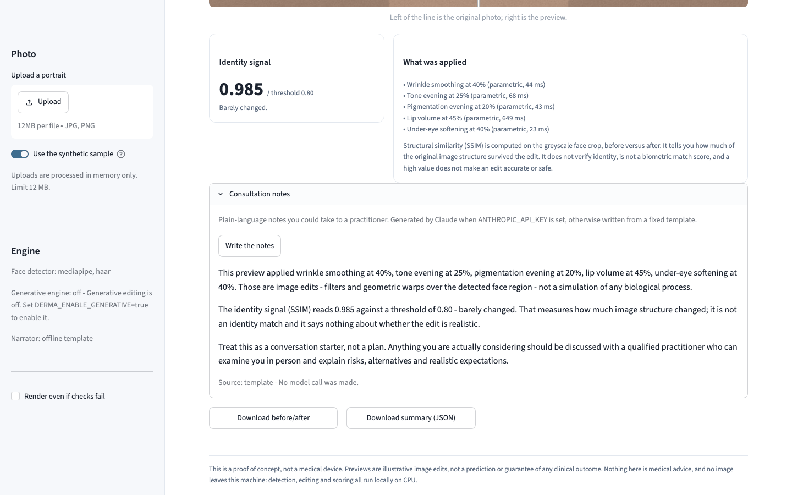
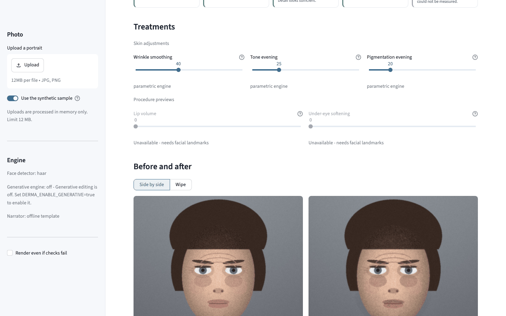
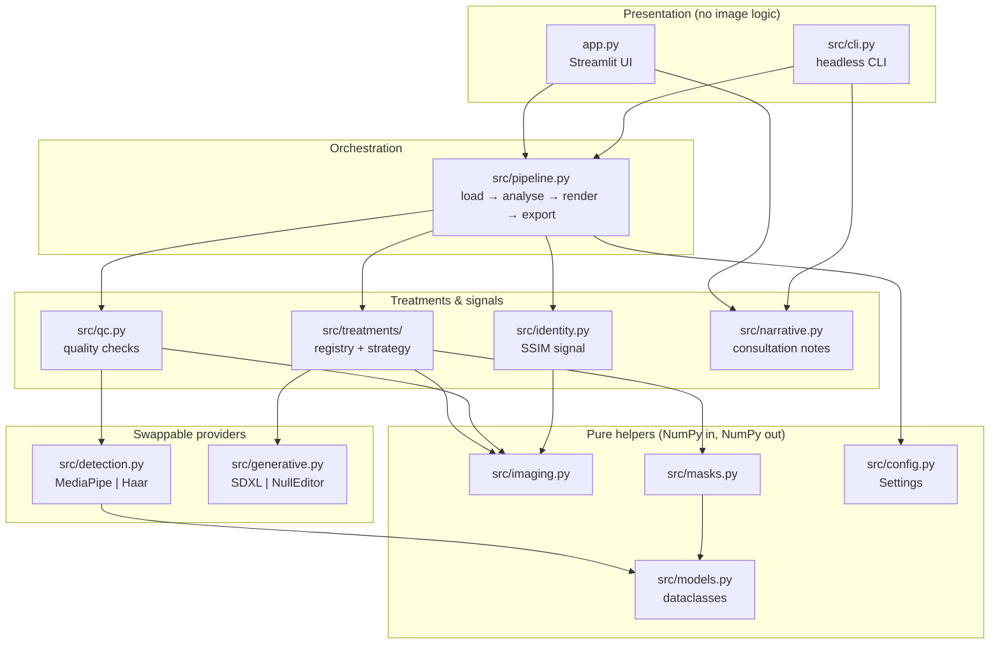

# Aesthetic Preview (Derma-Scan)

A local, CPU-only proof of concept that shows what common non-invasive cosmetic
adjustments would look like **as an image edit** on a portrait. It runs quality
checks on the photo, applies parametric skin adjustments and landmark-driven
procedure previews, always shows the original beside the result, and reports an
SSIM signal describing how much image structure the edit changed.

> **This is a proof of concept, not a medical device.** Previews are
> illustrative image edits — filters and geometric warps over a detected face
> region. They do not model biology and are not a prediction or guarantee of
> any clinical outcome. Nothing here is medical advice. No image leaves the
> machine it runs on.

---

## Screenshots

All screenshots use `assets/sample_face.jpg`, a procedurally generated portrait
produced by `tools/make_sample_face.py` from a fixed RNG seed. **No photograph
of a real person is committed to this repository.**

**The controls and the quality report.** Every check reports its own status;
a check the detector cannot measure says so rather than quietly passing.


**Before and after, with the identity signal.** The original is always on
screen next to the edit, and every applied treatment is itemised with the
engine that produced it and how long it took.



**Wipe comparison.** Left of the line is the untouched photo.



**Consultation notes.** Written by Claude when `ANTHROPIC_API_KEY` is set, and
from a fixed template otherwise — the screenshot shows the offline template.



**Graceful degradation.** This is the Docker image, which ships no optional ML
dependencies: face detection falls back to the OpenCV Haar cascade, the
landmark-driven procedures are disabled with the reason shown, and head tilt is
reported as "Not measured" instead of being invented.



The same pipeline runs headlessly:

```console
$ python -m src.cli assets/sample_face.jpg --wrinkle 55 --tone 30
Image      : assets/sample_face.jpg (768x768)
  [PASS] Face detected: One face located by the haar detector.
  [PASS] Face size (30.9 % of frame): Face fills enough of the frame.
  [PASS] Sharpness (141.5 Laplacian variance): Detail looks sufficient.
  [PASS] Lighting (130.2 mean brightness): Even light (contrast 43).
  [SKIP] Head tilt: The haar detector does not provide landmarks, so head tilt could not be measured.
Detector   : haar
  applied  Wrinkle smoothing @ 55% (parametric, 11 ms)
  applied  Tone evening @ 30% (parametric, 101 ms)
  applied  Pigmentation evening @ 20% (parametric, 12 ms)
Identity   : SSIM 0.979 (threshold 0.80) - Barely changed
Total      : 141 ms

This is a proof of concept, not a medical device. Previews are illustrative image edits, not a prediction or guarantee of any clinical outcome.
```

---

## Architecture

A **layered pipeline with a treatment registry**. Dependencies point inward:
presentation depends on orchestration, orchestration depends on the registry,
and nothing in the image layer imports Streamlit. Every optional capability —
landmarks, generative editing, the Claude narrator — sits behind a provider
interface with an availability probe, so the app runs, and the tests pass, with
none of them installed.



### The main flow

```mermaid
sequenceDiagram
    participant User
    participant UI as app.py
    participant Pipe as pipeline
    participant Det as detector
    participant Reg as treatment registry
    participant Ed as generative editor

    User->>UI: upload a portrait (or use the sample)
    UI->>Pipe: load_preview_image(bytes)
    Pipe-->>UI: RGB array, downscaled to preview_max_side
    Note over UI: cached by pixel fingerprint

    UI->>Pipe: analyse(image)
    Pipe->>Det: detect_face()
    Det-->>Pipe: FaceGeometry (bbox, landmarks?, roll?)
    Pipe-->>UI: QCReport (pass / fail / skipped per check)

    alt no face, or a check failed and the user has not forced it
        UI-->>User: show the photo and the reasons; stop
    else
        UI->>Pipe: treatment_availability(context)
        Pipe->>Reg: availability() per treatment
        Reg-->>UI: usable + reason (drives enabled/disabled sliders)

        User->>UI: move a slider
        UI->>Pipe: render_preview(image, report, intensities)
        loop each treatment with intensity > 0, in registry order
            Pipe->>Reg: apply(image, context, intensity)
            alt treatment supports generative and an editor is available
                Reg->>Ed: inpaint(masked region)
                Ed-->>Reg: repainted region
            else
                Note over Reg: parametric engine (warp / filter)
            end
            Note over Pipe: a treatment that raises is skipped and noted,<br/>never taken as a crash
        end
        Pipe->>Pipe: compute_identity(original, edited, bbox)
        Pipe-->>UI: PreviewResult (original, edited, applied, notes, SSIM)
        UI-->>User: before/after, identity signal, notes, export
    end
```

---

## Quickstart

### Docker (recommended)

```bash
docker compose up --build
# then open http://localhost:8200
```

One command, no manual steps. The image boots with the synthetic sample
portrait already loaded, so there is nothing to upload before you can see it
work. It ships **no** MediaPipe, torch or diffusers and downloads no model
weights — about 270 MB, and the parametric treatments are fully functional.

Stop it with `docker compose down -v`.

### Local

```bash
python -m venv .venv && source .venv/bin/activate
pip install -r requirements.txt
streamlit run app.py
```

Optional extras, each of which the app detects at runtime and reports in the
sidebar:

```bash
pip install -r requirements-landmarks.txt  # MediaPipe FaceMesh -> lip and under-eye previews
pip install -r requirements-ml.txt         # SDXL inpainting; also set DERMA_ENABLE_GENERATIVE=true
```

---

## Configuration

Every setting is read once, at startup, by `src/config.py`. Nothing else in the
codebase reads `os.environ`.

| Variable | Required | Default | What it does |
| --- | --- | --- | --- |
| `DERMA_PREVIEW_MAX_SIDE` | no | `1024` | Longest side an uploaded image is downscaled to before any processing. The main latency lever. |
| `DERMA_EXPORT_MAX_SIDE` | no | `2048` | Longest side of the downloadable before/after image. |
| `DERMA_MAX_UPLOAD_MB` | no | `12` | Upload size ceiling. Larger uploads are rejected with a clear message. |
| `DERMA_IDENTITY_MIN_SSIM` | no | `0.80` | Threshold the identity signal is reported against. Below it the UI warns that structure changed substantially. |
| `DERMA_FACE_DETECTOR` | no | `auto` | `auto`, `mediapipe` or `haar`. `auto` picks the best available; an unavailable preference falls back with a warning. |
| `DERMA_ENABLE_GENERATIVE` | no | `false` | Enables the SDXL inpainting engine. Needs `requirements-ml.txt`; without it the UI says so and uses the parametric engines. |
| `DERMA_SDXL_MODEL_ID` | no | `diffusers/stable-diffusion-xl-1.0-inpainting-0.1` | Model id passed to `from_pretrained`. |
| `DERMA_SDXL_MAX_SIDE` | no | `768` | Longest side of the region handed to the diffusion model. |
| `DERMA_NARRATOR_ENABLED` | no | `true` | Allows the Claude-generated consultation notes. With it off, the fixed template is always used. |
| `DERMA_NARRATOR_MODEL` | no | `claude-opus-5` | Model used for the notes. |
| `DERMA_LOG_LEVEL` | no | `INFO` | Python logging level. |
| `ANTHROPIC_API_KEY` | no | — | Enables Claude-generated consultation notes. **Unset is a supported state**: the app falls back to a deterministic template, and no test ever makes an API call. |

---

## Development

```bash
python -m venv .venv && source .venv/bin/activate
pip install -r requirements-dev.txt

streamlit run app.py                                  # the UI
python -m src.cli assets/sample_face.jpg --wrinkle 60 # headless, no browser
python tools/make_sample_face.py                      # regenerate the sample portrait

pytest                                                # 201 tests, ~2 s
ruff check .                                          # lint
ruff format .                                         # format
```

The test suite needs no GPU, downloads no model, makes no network call and
touches no real photograph. The optional stacks are replaced by fakes:
`tests/conftest.py` supplies a synthetic FaceMesh landmark array and a recording
generative editor, `tests/test_narrative.py` installs a fake `anthropic` module,
and `tests/test_generative.py` substitutes the SDXL pipeline. Everything passes
whether or not MediaPipe, torch or `anthropic` is installed.

---

## Project structure

```
.
├── app.py                      # Streamlit UI: widgets, layout, copy. No image logic.
├── src/
│   ├── config.py               # Settings dataclass; the only reader of os.environ
│   ├── models.py               # Domain dataclasses (FaceGeometry, QCReport, PreviewResult, ...)
│   ├── imaging.py              # Pure NumPy helpers: decode, downscale, mask, blend, warp, compare
│   ├── detection.py            # FaceDetector providers + registry (MediaPipe, Haar)
│   ├── masks.py                # Skin / lip-ring / under-eye masks from geometry
│   ├── qc.py                   # Upload quality checks -> CheckResult per check
│   ├── identity.py             # SSIM identity-preservation signal
│   ├── generative.py           # Optional SDXL inpainting behind a Protocol; NullEditor default
│   ├── narrative.py            # Claude-written consultation notes, with a template fallback
│   ├── pipeline.py             # Orchestration: load -> analyse -> render -> identity -> export
│   ├── cli.py                  # Headless entry point over the same pipeline
│   └── treatments/
│       ├── base.py             # Treatment ABC, TreatmentSpec, the registry  <- the extension seam
│       ├── parametric.py       # Wrinkle smoothing, tone evening, pigmentation evening
│       └── procedures.py       # Lip volume, under-eye softening (warp/tone or SDXL)
├── tools/make_sample_face.py   # Generates the synthetic sample portrait (seeded, reproducible)
├── assets/sample_face.jpg      # Seed data. Synthetic. Not a real person.
├── tests/                      # 201 tests; no GPU, no downloads, no network
├── docs/screenshots/           # README images, captured with Playwright at 1440x900
├── Dockerfile                  # Multi-stage, non-root, healthchecked, no ML deps
└── docker-compose.yml          # One command; host port 8200
```

---

## Design notes

### Separating the pipeline from the UI

The original version put orchestration inside `app.py`, which made every
behaviour untestable without a browser. Now `app.py` only renders widgets and
copy; `src/pipeline.py` owns the order of operations and knows nothing about
Streamlit. `src/cli.py` drives the identical code path headlessly, and there is
a test asserting the image layer never imports Streamlit. Domain types live in
`src/models.py` as plain frozen dataclasses with no OpenCV or Streamlit imports,
so the UI, the CLI and the tests can talk about a result without reaching into
pipeline internals.

### The extension seam: a treatment registry

Adding a treatment previously meant editing an effects module, the pipeline, the
UI and the CLI. Now it is one class:

```python
from src.treatments import ADJUSTMENT, Treatment, TreatmentSpec, register

@register
class Sepia(Treatment):
    spec = TreatmentSpec(
        key="sepia", label="Sepia", summary="Warms the skin region.",
        group=ADJUSTMENT, order=5, default=0,
    )

    def apply(self, image_rgb, context, intensity):
        ...  # must be a no-op at intensity 0
```

Import it in `src/treatments/__init__.py` and it appears as a slider in the UI,
as a `--sepia` flag in the CLI, in the JSON summary and in the consultation
notes. Nothing else changes. `TreatmentSpec` carries everything the UI needs to
render a control — label, help text, range, step, ordering, whether it needs
landmarks, whether a generative engine can serve it — so the UI never grows a
per-treatment branch. `tests/test_treatments.py` registers a treatment at test
time and asserts it reaches all of those surfaces.

The detector and the generative editor use the same shape: a `Protocol` with
`available()`, `unavailable_reason()` and the work method. Adding YuNet or
RetinaFace means implementing that Protocol and calling `register_detector`.

### Scalability on a CPU

The bottleneck is not throughput, it is per-interaction latency: Streamlit
re-runs the whole script on every slider nudge, and the naive implementation
re-decoded the image, rebuilt the FaceMesh graph, re-detected the face and ran
every filter over the full frame each time. Four changes, in order of impact:

1. **Downscale before processing.** Uploads are resized to
   `DERMA_PREVIEW_MAX_SIDE` immediately. Cost is quadratic in the longest side,
   so a 4000 px phone photo costs ~16× a 1024 px one for no visible gain.
2. **Filter inside the mask's bounding box, not the whole frame.**
   `imaging.masked_filter` crops to the region of interest, runs the expensive
   bilateral/CLAHE pass there, and blends back. The full-frame result was
   discarded everywhere the mask was zero anyway.
   `test_masked_filter_matches_a_full_frame_pass_for_a_shift_invariant_filter`
   pins that this optimisation does not change the output.
3. **Cache by content, not by widget state.** Decoding, detection and the skin
   mask are keyed on a SHA-256 fingerprint of the pixels
   (`imaging.image_fingerprint`), so moving a slider reuses all of them and only
   re-runs the treatments. The rendered preview is cached on
   `(fingerprint, intensities)`.
4. **Build heavy objects once.** The MediaPipe FaceMesh graph costs far more to
   construct than to run, and the original code built one per detection inside a
   `with` block. It is now built lazily and reused; the SDXL pipeline is loaded
   lazily behind a lock and only if generative editing is both enabled and
   installed.

On the 768 px sample a full parametric pass is ~140 ms on CPU, and a slider
change after the first render is bounded by the treatments alone.

### Honesty as a design constraint

This is a beauty-adjacent tool, so several decisions exist to stop it
overclaiming, and each is covered by a test:

- **The original is never absent.** The UI shows it beside the edit, and
  `pipeline.build_export` writes a side-by-side pair with a burnt-in disclaimer
  banner. There is no code path that exports a lone "after".
- **An unmeasurable check is `skipped`, not `pass`.** The Haar fallback has no
  landmarks and therefore no head-tilt estimate. The original code reported
  `roll_deg = 0.0`, which made the tilt check pass on evidence that did not
  exist. It now returns `None` and the UI says "Not measured".
- **The identity signal is described for what it is.** SSIM over the face crop
  measures how much image *structure* survived. It is not a biometric match and
  a high value does not make an edit accurate or safe — wording that ships in
  the UI, the CLI, the JSON export and the narrator prompt. A crop too small for
  an SSIM window reports `0.0` rather than a reassuring number.
- **Nothing silently fails.** A treatment whose region cannot be located, whose
  dependency is missing, or which raises, produces a note the user sees.
- **The narrator is constrained and optional.** Its system prompt forbids
  clinical claims, product or dose recommendations, and any comment on the
  person's appearance; it refuses to be a treatment plan and points at a
  qualified practitioner. Refusals, truncation and API failures all fall back to
  the deterministic template.

### Why Docker ships the lightweight path

MediaPipe, torch and diffusers turn a ~270 MB image into several gigabytes and
add a model download on first use. The point of a proof of concept is that
someone can run it in a minute, so the image ships the path that needs neither.
The README claim that the app works without them is therefore the path that is
actually built and booted in CI-shaped terms, not an untested fallback —
screenshot 5 is that image running.

---

## Limitations

- **Not a medical device, and not a simulation of anything biological.** The
  edits are filters and geometric warps. They cannot predict how tissue
  responds to a procedure, and nothing here should inform a real decision.
- **The identity signal is a change-magnitude measure, not identity
  verification.** It will not catch an edit that is structurally small but
  perceptually wrong.
- **Lip and under-eye previews need MediaPipe FaceMesh.** Without it the Haar
  cascade gives a bounding box only, so those treatments are disabled and the
  skin mask degrades to an inset ellipse. The app uses the legacy
  `mediapipe.solutions.face_mesh` API; builds from 0.10.30 onward drop
  `solutions` on some platforms, which is why `requirements-landmarks.txt` caps
  the version.
- **Generative editing is slow and untested end to end.** SDXL inpainting on
  CPU takes minutes per pass. The compositing and dispatch logic is tested with
  a fake pipeline; the model output itself is not, because no test may download
  weights.
- **One face per image**, frontal, reasonably lit. There is no multi-face
  handling, no pose correction and no profile support.
- **No persistence and no accounts.** Images are processed in memory and
  discarded; nothing is written to disk except what the user downloads.
- **The quality thresholds are heuristics**, tuned against the synthetic sample
  and a handful of portraits. They are configurable for that reason.

---

## License

MIT — see [LICENSE](LICENSE).
